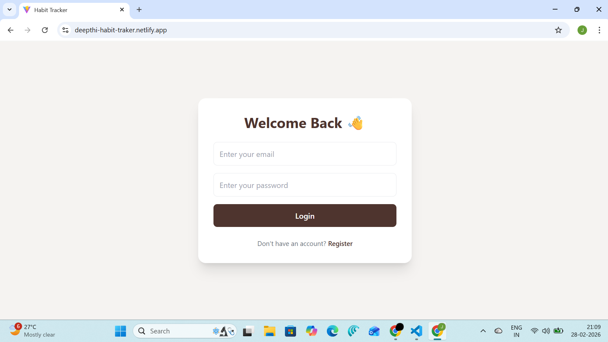
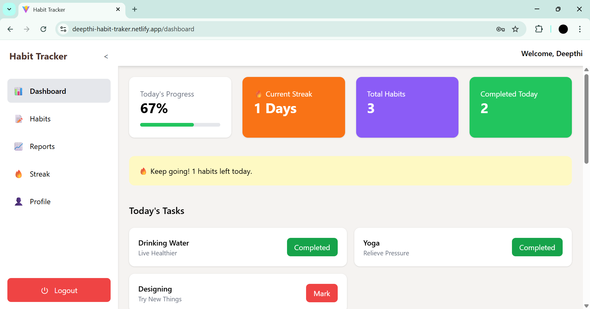
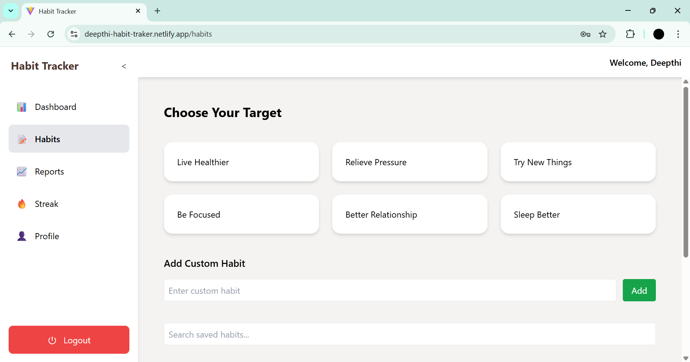
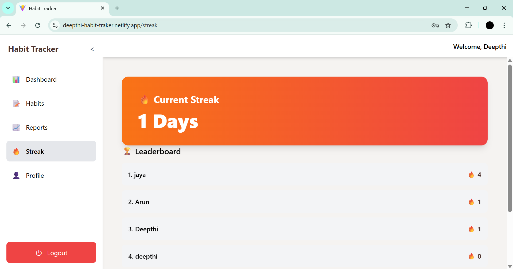
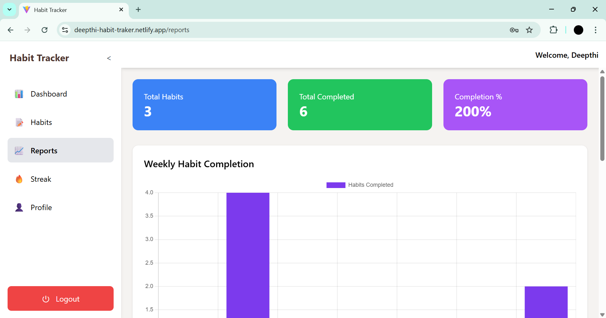
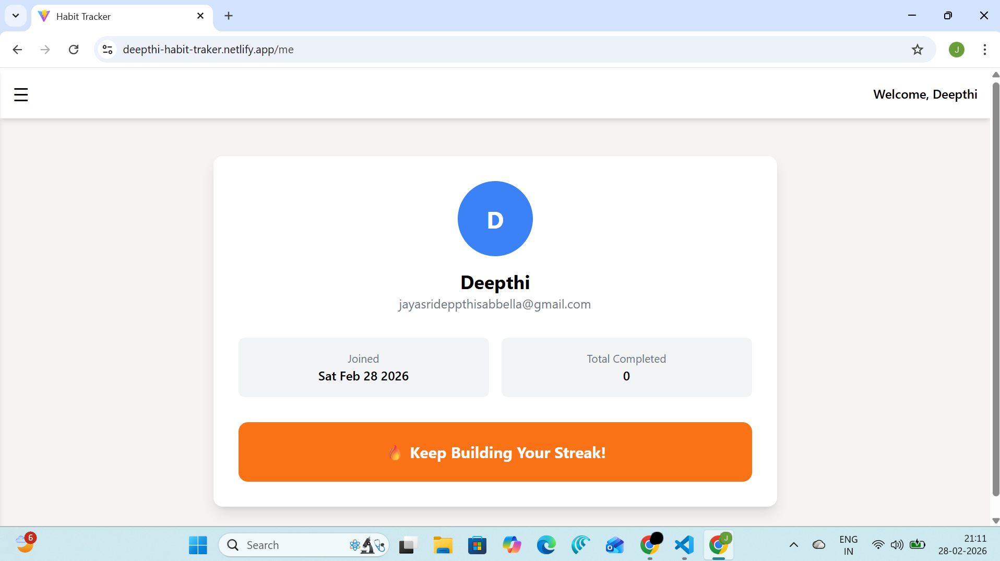

# Habit Tracker – Frontend

## Project Title
Habit Tracker – Productivity & Streak Management App

---

## Project Description

Habit Tracker is a modern web application that helps users build consistent habits, track daily progress, maintain streaks, and analyze performance through reports and leaderboard rankings.

This repository contains the **React frontend** of the application.

Users can:
- Add predefined or custom habits
- Mark habits as completed
- Track daily streaks
- View leaderboard
- Analyze weekly reports
- Manage profile information

---

## Features

- 🔐 Authentication (Login / Register)
- 🛡 Protected Routes
- 📊 Dashboard with Daily Progress
- 📅 Habit Tracking System
- 🔥 Streak Counter
- 🏆 Leaderboard
- 📈 Reports
- 🧑 User Profile Page
- 📱 Responsive Design
- 🎨 Custom Black-Brown Theme UI

---

## Tech Stack Used

- React.js
- React Router DOM
- Axios
- Tailwind CSS
- Context API (State Management)
- Vite (Build Tool)

---

## Installation Steps

1. Clone the Repository

git clone https://github.com/JayasriDeepthi-14/Habit_Tracker_Frontend.git

2. Navigate into folder

cd Habit_Tracker_Frontend

3. cd Habit_Tracker_Frontend

npm install

4. Start development server

npm run dev

Now, App runs at: http://localhost:5173

---

## Deployment Link

https://deepthi-habit-traker.netlify.app/

---

## Backend API Link

https://habit-tracker-backend-zzba.onrender.com/api

---

## Login Credentials

User can create their own Login UserId and Password

---

## Screenshots

### Login Page

### Register Page

### Dashboard

### Habits Page

### Streak Page

### Reports Page

### Me Page

---

## Video Walkthrough Link

https://drive.google.com/file/d/1ShcYLuzy4GE5y5w_k9t_V10ZniS0FSCM/view?usp=drivesdk